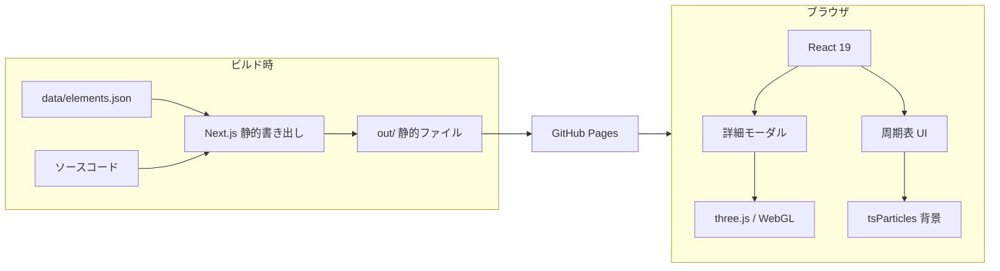
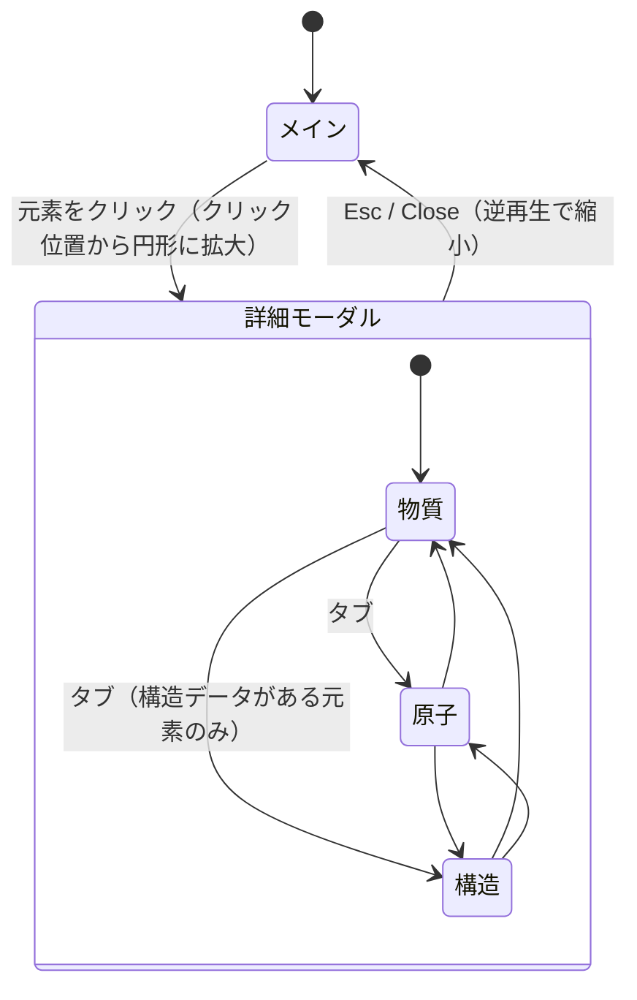

# 02. 基本設計書

| 項目 | 内容 |
|---|---|
| 版 | 1.0（2026-10-08） |
| 対象 | コミット `cb05c81` |

## 1. システム構成

サーバー処理のない静的サイトです。ビルド時に Next.js が HTML を書き出し（`output: "export"`）、ブラウザ側で React と WebGL（three.js）が動きます。



### 1.1 技術スタック

| 用途 | 採用 | バージョン（package.json） |
|---|---|---|
| フレームワーク | Next.js（App Router、静的書き出し） | 15.5.27 |
| UI | React | 19.1.0 |
| 言語 | TypeScript | ^5 |
| スタイル | Tailwind CSS | ^4 |
| UI アニメーション | Motion（`motion/react`） | ^14.0.0 |
| 3D | three / @react-three/fiber / @react-three/drei | ^0.186.1 / ^9.8.1 / ^10.7.9 |
| 背景パーティクル | @tsparticles/react、@tsparticles/slim | ^4.4.0 |
| 公開 | GitHub Pages（GitHub Actions） | — |

### 1.2 役割分担

| 演出 | 担当 | 場所 |
|---|---|---|
| 周期表の登場、ホバー、絞り込みの切り替え | Motion | `components/table/*` |
| 詳細モーダルの円形リビール（clip-path） | Motion | `ElementModal.tsx` |
| タブ・ボタンの切り替えインジケーター | Motion（`layoutId`） | `ViewTabs.tsx`、`PhaseControl.tsx`、`CategoryFilter.tsx` |
| メイン画面の背景の粒子 | tsParticles | `ParticleBackground.tsx` |
| 状態変化のパーティクル | React Three Fiber の自作 `Points` | `PhaseParticles.tsx` |

状態変化のパーティクルは、tsParticles ではなく自作です。理由は 07 章（設計判断）を参照してください。

## 2. 画面設計

### 2.1 画面一覧

| 画面 | 概要 | 実装 |
|---|---|---|
| メイン（周期表） | 118 元素のグリッド、中央に説明パネルとカテゴリフィルター | `app/page.tsx`、`components/table/PeriodicTable.tsx` |
| 詳細モーダル | 全画面で開く。左に 3D とコントロール、右に元素情報 | `components/detail/ElementModal.tsx` |

詳細モーダルには 3 つのビュー（タブ）があります。

| ビュー | 表示 | コントロール |
|---|---|---|
| Substance（物質） | 固体・液体・気体の 3D と、状態変化のパーティクル | 状態ボタン、温度スライダー、圧力スライダー |
| Atom（原子） | 核（陽子・中性子）と電子殻 | なし（説明文のみ） |
| Structure（構造） | 分子・結晶の球棒モデル。標準状態（298 K、1 atm）で固定 | なし。C は構造の切り替えボタン |

### 2.2 メイン画面のレイアウト

- 18 列のグリッドに、元素データの `xpos`・`ypos` で配置する。
- 第 6・7 周期の 3 列目に、ランタノイド（57–71）・アクチノイド（89–103）の位置を示す破線のセルを置く。
- ランタノイド・アクチノイドは、本体の下の別行に置く。
- 周期表の空き領域（3〜12 列、1〜3 行）に、タイトルまたはホバー中の元素の情報と、カテゴリフィルターを置く。
- 幅 880 px 未満では横スクロールする。

### 2.3 詳細モーダルのレイアウト

```
┌──────────────────────────────────┬───────────────┐
│ [元素番号 記号 名称 カテゴリ] [Close][タブ]│ 元素情報       │
│                                  │ （要約、数値、   │
│        3D ステージ                │  電子配置 等）   │
│                                  │               │
├──────────────────────────────────┤               │
│ コントロール（物質: 温度・圧力 / 他: 説明文）│               │
└──────────────────────────────────┴───────────────┘
```

- コントロールは 3D ステージの**下に分離**しており、3D と重ならない。
- 画面が狭い場合（1024 px 未満）は縦に積む。

## 3. 画面遷移



- モーダルは 0.75 秒、`[0.65, 0, 0.35, 1]` のイージングで開閉する。半径は、クリック位置から画面の最も遠い隅までの距離から計算する。
- タブを切り替えるとキャンバスを作り直す（ビューごとにカメラ位置が違うため）。

## 4. 状態管理

グローバルな状態ライブラリは使いません。

| 状態 | 保持する場所 | 内容 |
|---|---|---|
| 選択中の元素と、クリック位置 | `app/page.tsx` | モーダルの開閉 |
| カテゴリフィルター、ホバー中の元素 | `PeriodicTable.tsx` | 絞り込みと中央パネル |
| ビュー、温度、圧力、構造の選択 | `ElementModal.tsx` | 元素ごとに、モーダルを開くたびに初期化（298 K、1 atm） |
| 状態変化の進行（from / to / 進行度 / 温度 / 圧力） | `SubstanceView.tsx` の `ref` | 毎フレーム読む値は `ref` に置き、再描画を避ける |

## 5. コンポーネント構成

```
app/page.tsx
├─ ParticleBackground          tsParticles の背景
├─ PeriodicTable
│   ├─ CategoryFilter
│   └─ ElementCell × 118
└─ ElementModal                （選択時のみ。AnimatePresence で開閉）
    ├─ ModalScene              （動的 import、ssr:false。WebGL はここに集約）
    │   └─ SceneCanvas         照明、OrbitControls
    │       ├─ SubstanceView   固体メッシュ、液体、PhaseParticles
    │       ├─ AtomView        核と電子殻
    │       └─ StructureView   球棒モデル
    ├─ ViewTabs
    ├─ PhaseControl            状態ボタン、温度・圧力スライダー
    └─ ElementInfo             右側の元素情報
```

## 6. 3D 描画の設計

### 6.1 共通（`SceneCanvas.tsx`）
- 照明は、ネットワークから HDR を取得せず、`Lightformer` と灰色のドーム（金属の反射が真っ黒にならないようにするため）で構成する。
- `OrbitControls` に慣性（damping）を付け、操作するまで自動回転する。
- 解像度は `dpr=[1, 2]`。

### 6.2 物質ビュー（`SubstanceView.tsx`）

| 状態 | 表現 |
|---|---|
| 固体 | 元素ごとの形（インゴット、岩塊、結晶の集まり）と質感（`MeshPhysicalMaterial` とバンプ用のノイズ） |
| 液体 | drei の `MarchingCubes`（メタボール）。温度が高いほど広がる |
| 気体 | パーティクルの雲。色は元素の気体色。希ガスなどは発光色（放電管） |

#### 状態変化の仕組み
1. 状態が変わると `from` と `to` を更新し、進行度 `p` を 0 から 1 へ 2.0 秒かけて進める（`phaseAnim.ts`）。
2. 古い状態のメッシュは `p` が 0〜0.2 で縮小して消え、新しい状態のメッシュは 0.8〜1 で現れる。
3. その間、約 2,700 個（18×10×15）のパーティクルが、旧状態の配置から新状態の配置へ移る。各粒子に 0〜0.4 の遅延と、ランダムな回り込みの軌道を与える。
4. 気体は、パーティクルそのものが表現になる（常に表示）。

### 6.3 原子ビュー（`AtomView.tsx`）
- 陽子数＝原子番号、中性子数＝round(原子量) − 原子番号（**平均原子量からの推定で、特定の同位体ではない**。画面にも明記）。
- 核は `InstancedMesh` で、黄金螺旋状に詰めて配置する。
- 電子殻は元素データの `shells` を使い、殻ごとに傾けた軌道を、半径に応じた速さで周回する。

### 6.4 構造ビュー（`StructureView.tsx`）
- 結晶（BCC、FCC、HCP、ダイヤモンド、グラファイト、灰色セレンの鎖）と分子（H₂、N₂、O₂、F₂、Cl₂、Br₂、I₂、P₄、S₈）、貴ガス（単原子）を扱う。
- 常に標準状態の構造で、原子が振動する。結合の棒は、毎フレーム原子の位置から再計算して追従する。
- 二重・三重結合は、画面の縦方向にずらした 2〜3 本の棒で表す。

## 7. 主要な画面部品の仕様

### 7.1 温度スライダー（`PhaseControl.tsx`）
- 範囲: 0 K〜元素ごとの上限（04 章）。目盛りは線形。
- 転移点マーク: クリックで転移の直後（整数部 + 1 K）へジャンプする。近いマーク同士は 2 段に分ける。
- キー操作: ←/→（↑/↓）で 1 K、Shift を押すと 10 K。範囲内に収める。
- 「Equal phase widths」: 各状態にトラックの同じ幅を与える。目盛りが不均一になるため、注記を出し、K と °C は常に表示する。
- 298 K が範囲内なら、細い目印を出す。

### 7.2 圧力スライダー
- 0.001〜1000 atm の対数目盛。中央が 1 atm で、近くでは 1 atm に吸着する。

### 7.3 状態ボタン
- 安定でない状態、またはデータがない状態は無効にする。

## 8. エラー・例外時の動作

| 事象 | 動作 |
|---|---|
| WebGL が使えない | 3D が表示されない（専用のフォールバック表示は**未実装**） |
| 構造データがない元素 | Structure タブを無効にする |
| 融点・沸点のデータがない元素 | 判明している状態だけを有効にし、理由を注記する |
